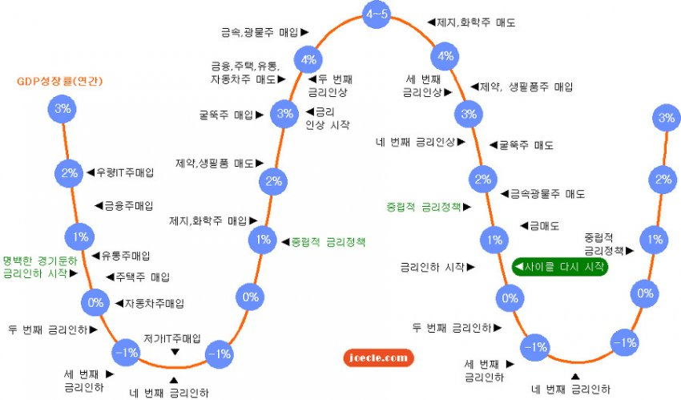
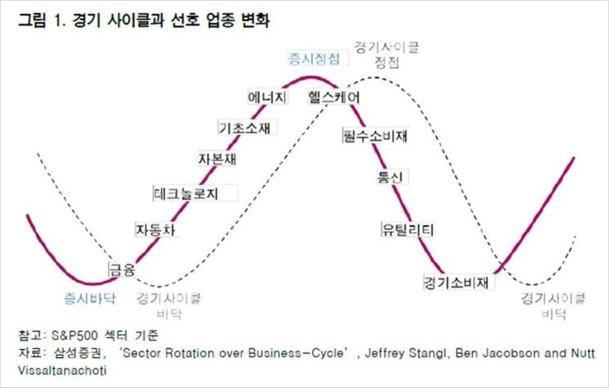
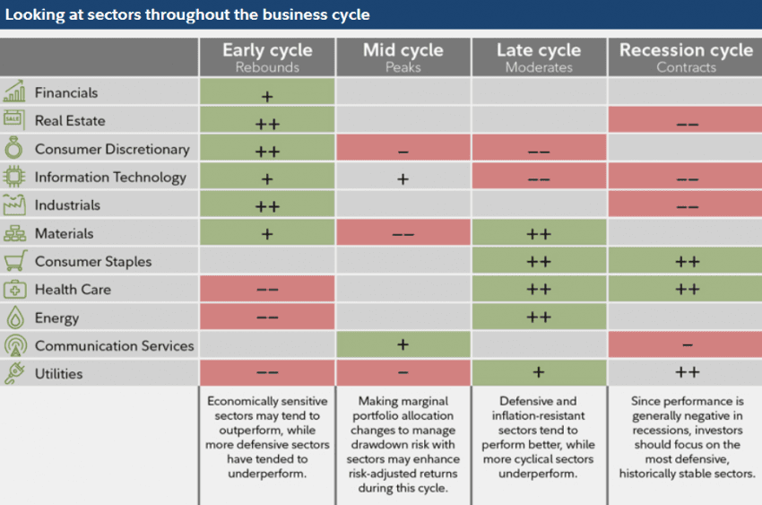

# 거시 경기 사이클과 섹터 로테이션

> 📚 **이 문서 한눈에**
> - **배우는 것**: ① 경기·금리가 돌고 도는 사이클(국면)이라는 개념, ② 국면이 바뀌면 강해지는 업종(섹터)도 순서대로 바뀐다는 "섹터 로테이션", ③ 이걸 미국식 경험칙으로 가늠하는 3가지 프레임워크
> - **난이도**: 🟡기본 (개념은 직관적이지만, 실제 투자 룰로 쓰려면 함정이 많아 주의가 필요)
> - **왜 중요(stockpick)**: "지금 경기 어디쯤?"이라는 맥락을 알면, 룰이 뽑은 종목을 더 잘 해석할 수 있다. 단, 시점 판단은 룩어헤드(미래 정보 누설) 함정이 커서 정량 룰에 직접 넣기 전 검증이 필수다.

경기와 금리는 순환한다. 그 국면(局面)에 따라 **돈이 몰리는 업종(섹터)이 순서대로 돈다** — 이걸 섹터 로테이션이라 한다. 이 노트는 "지금 사이클 어디쯤이고, 그러면 어떤 섹터가 상대적으로 강했나"를 가늠하는 세 가지 프레임워크를 모았다.

먼저 용어 몇 개만 풀고 가자.

- **경기 사이클(business cycle)** `(쉽게: 경제가 좋아졌다 나빠졌다를 반복하는 큰 물결)` — 경제는 한 방향으로만 가지 않고 회복 → 호황 → 둔화 → 침체 → 다시 회복을 반복한다.
- **금리 사이클(interest-rate cycle)** `(쉽게: 중앙은행이 돈값(이자)을 올렸다 내렸다 하는 흐름)` — 경기가 과열되면 금리를 올려 식히고, 경기가 식으면 금리를 내려 살린다. 그래서 금리와 경기는 짝을 이뤄 돈다.
- **섹터(sector)** `(쉽게: 비슷한 사업끼리 묶은 업종 바구니 — 금융, IT, 에너지 등)` — 개별 종목이 아니라 업종 단위로 본다.
- **섹터 로테이션(sector rotation)** `(쉽게: 국면이 바뀔 때마다 강세 업종이 바통 터치하듯 순서대로 바뀌는 현상)` — 이 문서의 핵심 주제다.

> 🍞 비유: 사계절이 봄 → 여름 → 가을 → 겨울로 돌듯, 경기도 국면이 돈다. 그리고 계절마다 잘 팔리는 물건(여름엔 선풍기, 겨울엔 패딩)이 다르듯, 국면마다 잘 나가는 업종이 다르다 — 이게 섹터 로테이션이다. (어디까지나 직관을 돕는 비유이며, 실제 시장은 계절처럼 정확히 예측되지 않는다.)

> 🔧 비유: Spring으로 치면, `@Scheduled` 잡이 정해진 순서로 돌듯 국면→섹터가 도는 그림이지만, 실제로는 **타이밍이 들쭉날쭉하고 사후에야 어느 국면이었는지 확정**된다는 점이 다르다. 컴파일 타임에 확정되는 enum 순서가 아니라, 런타임에 노이즈 섞여 들어오는 이벤트 스트림에 가깝다. (개발자 직관용 비유)

> ⚠️ 셋 다 **미국·글로벌(S&P500) 기준의 경험칙**이다. 한국 시장은 섹터 구성(수출주·반도체 비중)이 달라 1:1 대응이 안 된다. 시점 판단은 후행 확인이 많아 **룩어헤드 함정**이 크다 — 룰로 쓰려면 검증 필수.
>
> 📝 용어: **경험칙** `(쉽게: 과거에 대체로 그랬다는 경험 기반 규칙 — 물리법칙처럼 항상 맞는 게 아님)`. **룩어헤드(look-ahead) 함정** `(쉽게: "지금 어느 국면인지"는 한참 지나야 확정되는데, 마치 그때 알고 있었던 척 과거를 해석하면 백테스트 성적이 부풀려지는 착시)`.

---

## 1. 금리 사이클 시계 — 국면별 매수 섹터

> 🖼️ 그림 읽는 법: 위 이미지는 시계처럼 둥근 원이고, 한 바퀴 도는 것이 경기 한 사이클이다. 시계 방향으로 따라가며 "이 시각(국면)엔 어떤 섹터를 산다"를 읽으면 된다.

원형(시계) 모델. 한 바퀴가 금리 인하 → 저점 → 인상 → 고점 → 다시 인하로 도는 한 사이클이다. GDP 성장률(연간) `(쉽게: 나라 경제가 1년 동안 얼마나 커졌는지를 나타내는 성적표 — 경기의 체온계)`이 바깥 눈금, 안쪽에 그 시점에 사는 섹터가 붙어 있다.

대략의 흐름(시계 방향):

- **금리 인하 시작 (경기 저점 근처)** — 유동성주 `(쉽게: 돈이 풀리면(유동성↑) 먼저 반응하는 업종 — 대표적으로 금융)`·금융주 먼저. "본격적 경기침체기 금리인하 시작" 구간에서 유동성에 민감한 업종부터 반응.
- **금리 인하 마무리 → 저점 통과** — 제3IT주·자동차주 등 경기 민감 초기 회복주 `(쉽게: 경기가 살아나기 시작할 때 가장 먼저 좋아지는, 경기에 민감한 종목들)`.
- **종합적 금리정책(중립) → 인상 시작** — 제약·생필품주, 굴뚝주(소재) `(쉽게: 철강·화학처럼 공장 굴뚝에서 연기 나는 무거운 산업 — 경기 확장 중후반에 강함)`, 자동차·주택·금융주로 확산. 경기 확장 본격화.
- **금리 인상 지속 (경기 고점 근처)** — 제지·화학주, 정유·생필품주 등 후기 사이클·인플레 수혜주 `(쉽게: 물가가 오를 때(인플레) 오히려 이득 보는 업종 — 정유·소재 등)`.
- **고점 통과 → 금리 인하 재시작** — 경기방어주 `(쉽게: 경기가 나빠져도 사람들이 꼭 사는 것 — 전기·물·생필품 등이라 덜 흔들리는 업종)`(굴뚝·필수소비)로 이동하며 사이클 다시 시작.

핵심: 금리는 **경기에 후행/동행** `(쉽게: 후행=경기보다 늦게 움직임, 동행=경기와 같이 움직임)`하고, 섹터 강세는 그 안에서 순서를 탄다. (출처 워터마크: jceele.com)

> 🍞 비유: 금리 인하 = 경제에 "응급 수액" 놓는 것, 금리 인상 = "과열 식히는 해열제". 수액 맞을 땐 회복 초기주가, 해열제 쓸 만큼 뜨거울 땐 후기 사이클주가 강하다고 외우면 흐름이 잡힌다. (직관용 비유)

---

## 2. 경기 사이클과 선호 업종 변화 (삼성증권)

> 그림 1. 경기 사이클과 선호 업종 변화
> 참고: S&P500 섹터 기준 · 자료: 삼성증권, *Sector Rotation over Business-Cycle*, Jeffrey Stangl, Ben Jacobson and Nutt Vissaltanachoti

> 🖼️ 그림 읽는 법: 위 이미지는 위아래로 출렁이는 파도(사인 곡선) 한 개다. 곡선이 올라가는 구간 = 경기 좋아지는 시기, 내려가는 구간 = 나빠지는 시기. 곡선 위에 업종 이름들이 강세 순서대로 박혀 있다.

사인(sin) 곡선 `(쉽게: 위아래로 부드럽게 출렁이는 파도 모양 곡선)` 한 주기 위에 업종을 올려놓은 그림. **증시 바닥 → 증시 정점 → 다시 바닥**으로 오르내리는 동안 강세 업종이 다음 순서로 바뀐다:

| 국면 | 강세 업종 (등장 순서) |
|---|---|
| 증시 바닥 → 상승 초입 | 금융 → 자동차 → 테크놀로지 |
| 상승 중반 | 자본재 → 기초소재 |
| 증시 정점 부근 | 에너지 → 헬스케어 |
| 정점 → 하락 | 필수소비재 → 통신 |
| 하락 중반 → 바닥 | 유틸리티 → 경기소비재 |

> 📝 표 용어 풀이: **자본재** `(쉽게: 기계·장비·건설 등 기업이 생산에 쓰는 물건 — 경기 살아나면 투자 늘며 강세)` · **기초소재** `(쉽게: 철강·화학 등 다른 산업의 원재료)` · **유틸리티** `(쉽게: 전기·가스·수도 — 경기 나빠도 꼭 쓰니 대표적 방어주)` · **경기소비재** `(쉽게: 자동차·여행처럼 형편 좋을 때 쓰는 소비 — 경기에 민감)`.

읽는 법: 곡선 **왼쪽 오르막**은 경기 민감·성장(금융·자동차·테크), **오른쪽 내리막**은 방어주(필수소비·통신·유틸리티). 정점 직전에 에너지·소재 같은 인플레/후기 사이클 업종이 마지막으로 끓는 게 전형적 신호.

> 🍞 비유: 파티(경기 호황)가 무르익을수록 처음 온 손님(금융·테크)에서 → 막판에 술·안주(에너지·소재)로 분위기가 옮겨가고, 파티가 끝나면 정리하는 사람들(방어주)만 남는다고 보면 순서가 외워진다. (직관용 비유)

---

## 3. 사이클 국면별 섹터 성과표 (Fidelity형)

> "Looking at sectors throughout the business cycle"

> 🖼️ 그림 읽는 법: 위 이미지는 가로·세로 격자(매트릭스)다. 세로줄(행)은 섹터, 가로줄(열)은 경기 4국면. 칸에 색/부호로 "그 국면에 이 섹터가 시장 평균보다 잘했나/못했나"를 표시한다.

행 = 섹터, 열 = 4개 국면. 각 칸의 부호는 그 국면의 **상대 성과 경향** `(쉽게: 시장 평균과 비교해 더 올랐나(아웃퍼폼) 덜 올랐나(언더퍼폼)를 나타냄 — 절대 수익이 아니라 '평균 대비')`: `++` 강한 아웃퍼폼, `+` 아웃퍼폼, `--` 언더퍼폼, 빈칸 = 뚜렷한 경향 없음.

> 📝 용어: **아웃퍼폼(outperform)** `(쉽게: 시장 평균보다 잘함)` · **언더퍼폼(underperform)** `(쉽게: 시장 평균보다 못함)`. 둘 다 "평균과 비교한" 상대 개념이라, 아웃퍼폼이어도 시장 전체가 빠지면 마이너스일 수 있다.

| 섹터 | Early (반등) | Mid (정점) | Late (둔화) | Recession (수축) |
|---|---|---|---|---|
| Financials (금융) | + | | | -- |
| Real Estate (부동산) | ++ | | | -- |
| Consumer Discretionary (경기소비) | ++ | | -- | -- |
| Information Technology (IT) | + | + | -- | -- |
| Industrials (산업재) | ++ | | | -- |
| Materials (소재) | + | -- | ++ | |
| Consumer Staples (필수소비) | | | ++ | ++ |
| Health Care (헬스케어) | | | ++ | ++ |
| Energy (에너지) | | | ++ | |
| Communication Services (통신) | | + | | |
| Utilities (유틸리티) | | | + | ++ |

> 📝 4국면 용어 풀이: **Early(반등)** `(쉽게: 침체 끝, 경기가 막 살아나는 초기 — 회복 초기)` · **Mid(정점)** `(쉽게: 경기 한창 좋은 확장기 — 성장 안정 구간)` · **Late(둔화)** `(쉽게: 좋긴 한데 성장세가 꺾이기 시작, 물가는 높은 후기 국면)` · **Recession(수축)** `(쉽게: 경기 실제로 나빠지는 침체기)`.

국면별 한 줄 해설(표 하단 원문 요약):

- **Early**: 경기 민감(financially sensitive) 섹터가 아웃퍼폼, 방어주는 언더퍼폼.
- **Mid**: 한계적 비중 조정 국면 — 사이클 후반 리스크를 관리하며 위험조정수익 `(쉽게: 변동성(위험)까지 감안해 따진 수익 — 같은 수익이면 덜 출렁인 쪽이 더 좋다고 봄)`을 노림.
- **Late**: 방어·인플레 저항 섹터가 잘 버팀, 경기 민감 섹터는 언더퍼폼.
- **Recession**: 성과가 대체로 마이너스 — 역사적으로 안정적인 가장 방어적인 섹터에 집중.

> 🍞 비유: 표 한 줄(섹터)을 왼쪽→오른쪽으로 읽으면 그 업종이 사계절 중 언제 빛나는지 한눈에 보인다. 예를 들어 필수소비·헬스케어·유틸리티는 오른쪽(Late·Recession)에 `++`가 몰려 있어 "겨울에 강한 패딩" 같은 방어주임을 알 수 있다. (직관용 비유)

---

## ✅ 핵심 정리

- 경기와 금리는 **돌고 도는 사이클**이고, 국면이 바뀌면 **강세 업종이 순서대로 바통 터치**한다 — 이게 섹터 로테이션.
- 큰 그림: **오르막(회복·확장)엔 경기 민감·성장주**(금융·자동차·IT·소재), **내리막(둔화·침체)엔 방어주**(필수소비·헬스케어·유틸리티·통신)가 상대적으로 강한 경향.
- 정점 직전엔 **에너지·소재 같은 후기 사이클·인플레 수혜주**가 마지막으로 끓는 게 전형적 신호.
- 위 3가지는 모두 **미국·S&P500 기준 경험칙**이라 한국(반도체·2차전지·수출주 비중이 다름)에 1:1로 못 쓴다.
- "지금 어느 국면인가"는 **사후에야 확정**되므로 룩어헤드 함정이 크다 — 정량 룰에 넣기 전 반드시 검증.

## 🧠 셀프 체크

1. 섹터 로테이션이란 무엇이고, 왜 "국면이 바뀌면 업종도 바뀐다"고 하는지 한 문장으로 설명해 보자.
2. 경기 회복 초기(Early)와 침체기(Recession)에 각각 상대적으로 강한 섹터 유형(경기 민감주 vs 방어주)은 무엇일까? 표(3번)에서 근거를 찾아보자.
3. 이 3가지 프레임워크를 한국 주식 투자 룰에 "그대로" 넣으면 안 되는 이유 2가지(섹터 구성 차이 / 룩어헤드)를 말해 보자.

---

## stockpick 연결 메모

- 이 셋은 **"지금 어느 국면"이라는 시점 판단**에 의존한다. 시점 판단은 사후에야 분명해지므로(룩어헤드), 정량 룰에 직접 넣기 전 반드시 **시점 t엔 ≤t 데이터만**으로 재현되는지 확인한다.
- 한국 적용 시 섹터 매핑(예: 반도체·2차전지 비중)이 미국과 크게 달라, 위 순서를 그대로 쓰면 안 됨. 참고 배경으로만.
- 활용 후보: 룰이 뽑은 Top20을 **국면 맥락에서 재검토**하는 정성 보정(세션 토의) 재료. 알파 소스가 아니라 해석 보조.
