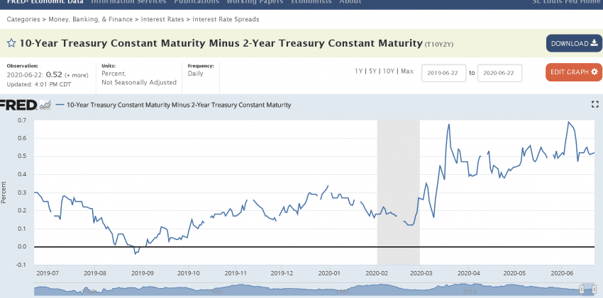

# 연준(Fed)·재무부 유동성 추적

> 연준과 재무부의 정책, 시장의 유동성과 그 영향을 **2차 해설이 아니라 1차 출처에서 직접 확인**하는 방법.

시장 유동성의 큰 줄기는 (1) 연준이 자산을 늘리느냐 줄이느냐(QE/QT), (2) 재무부가 국채를 얼마나 찍어 유동성을 빨아들이느냐로 갈린다. 아래 출처들은 그걸 가공 없이 보여준다.

---

## 0. 연준 홈페이지

- https://www.federalreserve.gov/default.htm
- 장중에 연준이 들고 있던 카드를 홈페이지로 **서프라이즈 공개**하기도 함. (예: 하락장 월요일, SMCCF를 통한 회사채 매입 발표 후 급반등)
- FOMC 결과를 보도자료·FOMC 의사록 등으로 확인 가능.

## 1. 연준 대차대조표 (H.4.1) — 매주 목요일 동부시 16:30 발표

- https://www.federalreserve.gov/releases/h41/
- 연준 **자산이 늘고 있는지/줄고 있는지** 확인. → 유동성 방향의 1차 신호.
- 주간 국채 매입 증감, MBS 매입 증감, 대출(PPP·메인스트리트 렌딩 프로그램 등), 체결국 SWAP 증감 확인 가능.
- 페이지에서 `June 04 / 11 / 18` 같은 발표 날짜를 클릭하면 해당 주 데이터가 나옴.

## 2. 연준 자산 매입 계획 및 결과 (뉴욕 연준, 매주 목요일 장 마감 무렵)

- https://www.newyorkfed.org/markets/domestic-market-operations/monetary-policy-implementation/treasury-securities/treasury-securities-operational-details
- 원래는 주간 단위로 "몇 년물 쿠폰/TIPS를 몇 시에 얼마만큼 사겠다"를 발표.
- QE를 시장 봐가며 조절하는 추세라 발표 주기가 바뀜(예: 3주치를 묶어 발표).
- **Schedule** = 매입 계획, **Result** = 무엇을 얼마만큼 언제 샀는지 실적.

## 3. 재무부 국채(미국채) 발행 계획 및 실적

> 재무부의 국채 발행은 시장 유동성을 **흡수**하는 행위 — 연준 매입과 반대 방향.

- 분기별 발행 계획(Quarterly Refunding):
  https://www.treasury.gov/resource-center/data-chart-center/quarterly-refunding/Pages/Quarterly-Financing-Estimates.aspx
- 발행 실적·재무부 대차대조표:
  https://www.treasurydirect.gov/instit/annceresult/annceresult_research.htm
- 부채(Primary Dealers용 Excel 등) 상세:
  https://www.treasurydirect.gov/govt/reports/pd/mspd/2020/2020_may.htm
  (해당 월의 *Excel File for Primary Dealers* 클릭 → 부채 내역 확인)

## 4. FRED — 세인트루이스 연준 데이터 사이트

- https://fred.stlouisfed.org/
- 각종 지표를 그래프로 쉽게 조작/비교. 검색창에 검색어(단기금리·장기금리 등) 입력 후 입맛대로 비교. **한국 지표도 제공**.

---

## 핵심 지표 예시: 장단기 금리차 (10Y − 2Y) = 침체 선행 지표

> FRED: *10-Year Treasury Constant Maturity Minus 2-Year Treasury Constant Maturity* (T10Y2Y)

- **장기 금리 − 단기 금리** 스프레드. 평소엔 장기가 높아 (+)값.
- 이 값이 **0 아래(역전, inverted)**로 내려가면 — 단기 금리가 장기보다 높아짐 — 역사적으로 **경기 침체 선행 신호**로 읽힌다. (시장이 가까운 미래의 금리 인하/둔화를 미리 반영)
- 차트의 회색 음영 = NBER 침체 구간. 역전 이후 시차를 두고 침체가 오는 패턴.

> ⚠️ "역전 → 침체"는 **선행이지 타이밍이 아니다**. 역전 후 실제 침체까지 수개월~1년+ 시차. 단독 매매 신호로 쓰면 위험. 유동성 국면을 읽는 배경 지표로 사용.

---

## stockpick 연결 메모

- 미국 연준·재무부 유동성은 **글로벌 위험자산 전반**(한국 주식 포함)에 간접 작용한다. 직접 알파 신호 아님.
- 위 1차 출처들은 데이터 수집 자동화 후보가 아니라(미국·수동 확인용), **세션 토의 시 거시 배경 점검 체크리스트**로 활용.
