# SEC 공시의 전체적인 틀 (EDGAR 공시 빠르게 읽는 법)

> 기업의 공시 내용을 확인하려면 종류가 너무 많고 오래 걸린다. 그래서 **공시의 전체 틀을 분해**해, 자주 쓰는 유형만 추려 빠르게 읽는 법을 정리한 노트.
>
> SEC 제출 양식의 제출 유형은 매우 많아 **자주 활용하는 유형만** 다룬다. (원작자 주: 일부 유형은 이해가 정확하지 않을 수 있음 — 교차검증 권장)

핵심 아이디어: 제출 유형(무슨 서류냐)과 8-K의 섹션·아이템 번호(무슨 사건이냐)가 눈에 익으면, 쏟아지는 공시를 **하나하나 안 읽어도 흐름으로 연결**해 "지금 무슨 일이 벌어졌는지" 답이 빨리 나온다.

> 📚 대상은 **미국 SEC/EDGAR**. 한국은 공시 체계가 DART라 양식·번호가 다르다. 한국 주식 분석에 직접 쓰진 못하고, 미국 상장사·해외 사례를 볼 때의 참고 틀.

---

## 챕터 1. 제출 유형 (Filing Types)

"무슨 종류의 서류인가". 카테고리별로 묶었다.

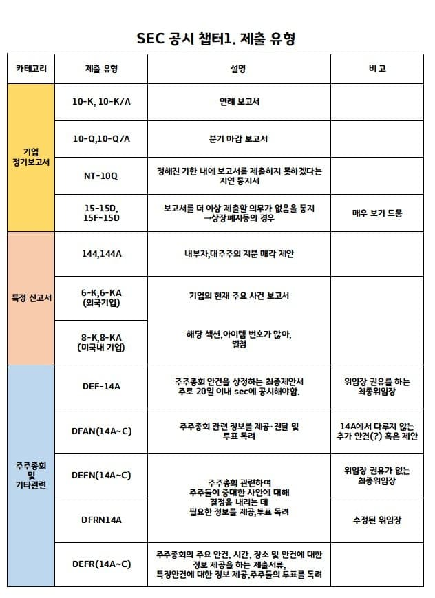
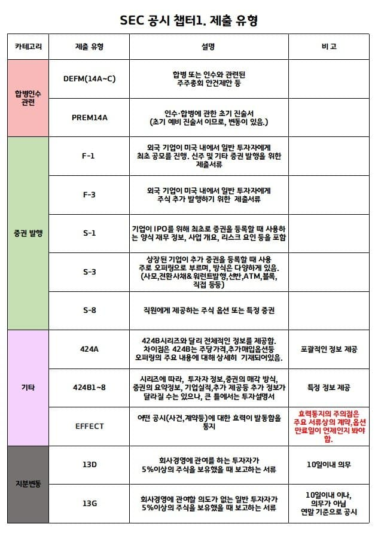

### 기업 정기보고서

| 제출 유형 | 설명 | 비고 |
|---|---|---|
| 10-K, 10-K/A | 연례 보고서 | |
| 10-Q, 10-Q/A | 분기 마감 보고서 | |
| NT-10Q | 정해진 기한 내 보고서를 제출하지 못하겠다는 **지연 통지서** | |
| 15-15D, 15F-15D | 보고서 제출 의무가 더 이상 없음을 통지 → **상장폐지 등** | 매우 보기 드뭄 |

### 특정 신고서

| 제출 유형 | 설명 | 비고 |
|---|---|---|
| 144, 144A | 내부자·대주주의 지분 매각 제안 | |
| 6-K, 6-KA (외국기업) | 기업의 현재 주요 사건 보고서 | |
| 8-K, 8-KA (미국 내 기업) | 주요 사건 보고서 | 해당 **섹션·아이템 번호가 많아 챕터 2에 별첨** |

### 주주총회 및 기타 관련

| 제출 유형 | 설명 | 비고 |
|---|---|---|
| DEF-14A | 주주총회 안건을 상정하는 **최종 제안서**. 주로 20일 이내 SEC 공시 | 위임장 권유를 하는 **최종 위임장** |
| DFAN(14A~C) | 주주총회 관련 정보 제공·전달 및 투표 독려 | 14A에서 다루지 않는 추가 안건 혹은 제안 |
| DEFN(14A~C) | 주주총회 관련 주주들이 중대한 사안을 결정하는 데 필요한 정보 제공·투표 독려 | 위임장 권유가 **없는** 최종 위임장 |
| DFRN14A | (위와 동) | **수정된** 위임장 |
| DEFR(14A~C) | 주주총회 주요 안건·시간·장소 정보 제공, 특정 안건 정보 제공, 투표 독려 | |

### 합병·인수 관련

| 제출 유형 | 설명 | 비고 |
|---|---|---|
| DEFM(14A~C) | 합병 또는 인수와 관련된 주주총회 안건 제안 등 | |
| PREM14A | 인수·합병에 관한 **초기 진술서** (초기 예비 진술서이므로 변동 있음) | |

### 증권 발행

| 제출 유형 | 설명 | 비고 |
|---|---|---|
| F-1 | 외국 기업이 미국 내에서 일반 투자자에게 **최초 공모(IPO)**. 신주·기타 증권 발행 제출서류 | |
| F-3 | 외국 기업이 미국 내에서 일반 투자자에게 **주식 추가 발행** 제출서류 | |
| S-1 | 기업이 **IPO** 위해 최초로 증권을 등록할 때. 재무 정보·사업 개요·리스크 요인 포함 | |
| S-3 | 상장 기업이 **추가 증권 등록**. 주로 "오퍼링". 방식 다양(사모·전환사채&워런트·선반·ATM·블록·직접 등) | |
| S-8 | 직원에게 제공하는 주식 옵션 또는 특정 증권 | |

### 기타 (투자설명서·효력)

| 제출 유형 | 설명 | 비고 |
|---|---|---|
| 424A | 424B 시리즈와 달리 **전체적인 정보** 제공 | 포괄적 정보 제공 |
| 424B1~8 | 시리즈에 따라 투자자 정보·매각 방식·기업 실적·추가 정보 등 달라지나, 큰 틀은 **투자설명서**. 424B는 주당 가격·추가매입옵션 등 오퍼링 주요 내용을 상세 기재 | 특정 정보 제공 |
| EFFECT | 어떤 공시(사건·계약 등)에 대한 **효력이 발동함을 통지** | ⚠️ 효력통지의 주의점: 주요 서류상의 계약·옵션 **만료일이 언제인지** 봐야 함 |

### 지분 변동

| 제출 유형 | 설명 | 비고 |
|---|---|---|
| 13D | 회사 경영에 **관여하는** 투자자가 5% 이상 보유 시 보고 | 10일 이내 의무 |
| 13G | 회사 경영에 관여 **의도 없는** 일반 투자자가 5% 이상 보유 시 보고 | 10일 이내이나 의무 아님 / 연말 기준 공시 |

---

## 챕터 2. 섹션·아이템 번호 (8-K Sections & Items)

8-K(주요 사건 보고서)는 "무슨 사건이냐"를 **섹션.아이템 번호**로 분류한다. 번호만 봐도 사건의 성격을 안다.

> ※ **섹션 번호와 아이템 번호는 겹치는 경우가 많다.** (아래 표에 `(item)` 표기는 섹션이 아니라 아이템 번호로 쓰인 경우)

### 섹션 1 — 특정 사건

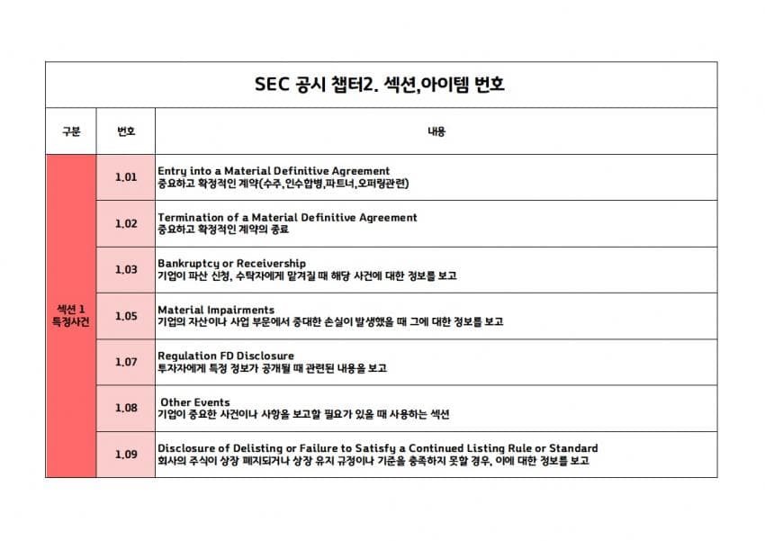

| 번호 | 항목 (영문) | 내용 |
|---|---|---|
| 1.01 | Entry into a Material Definitive Agreement | 중요하고 확정적인 계약 (수주·인수합병·파트너·오퍼링 관련) |
| 1.02 | Termination of a Material Definitive Agreement | 중요하고 확정적인 계약의 종료 |
| 1.03 | Bankruptcy or Receivership | 파산 신청·수탁자 관리 사건 보고 |
| 1.05 | Material Impairments | 자산·사업 부문의 중대 손실 발생 보고 |
| 1.07 | Regulation FD Disclosure | 투자자에게 특정 정보 공개 관련 보고 |
| 1.08 | Other Events | 중요한 사건·사항 보고가 필요할 때 쓰는 섹션 |
| 1.09 | Disclosure of Delisting or Failure to Satisfy a Continued Listing Rule or Standard | 상장 폐지 또는 상장 유지 규정·기준 미충족 보고 |

### 섹션 2 — 재무 영향

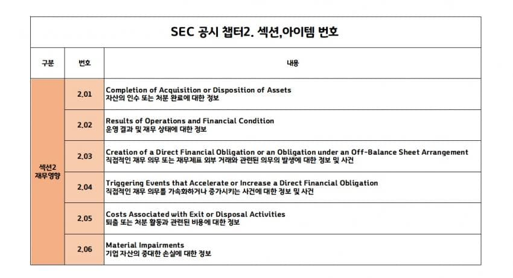

| 번호 | 항목 (영문) | 내용 |
|---|---|---|
| 2.01 | Completion of Acquisition or Disposition of Assets | 자산 인수·처분 완료 정보 |
| 2.02 | Results of Operations and Financial Condition | 운영 결과 및 재무 상태 정보 |
| 2.03 | Creation of a Direct Financial Obligation or an Obligation under an Off-Balance Sheet Arrangement | 직접 재무 의무·부외(off-balance) 거래 의무 발생 정보 |
| 2.04 | Triggering Events that Accelerate or Increase a Direct Financial Obligation | 직접 재무 의무를 가속·증가시키는 사건 정보 |
| 2.05 | Costs Associated with Exit or Disposal Activities | 퇴출·처분 활동 관련 비용 정보 |
| 2.06 | Material Impairments | 기업 자산의 중대 손실 정보 |

### 섹션 3 — 상장 관련·임원 관련

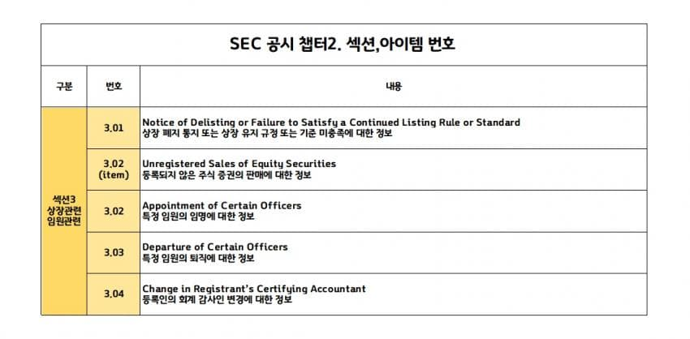

| 번호 | 항목 (영문) | 내용 |
|---|---|---|
| 3.01 | Notice of Delisting or Failure to Satisfy a Continued Listing Rule or Standard | 상장 폐지 통지 또는 상장 유지 규정·기준 미충족 정보 |
| 3.02 (item) | Unregistered Sales of Equity Securities | 등록되지 않은 주식 증권 판매 정보 |
| 3.02 | Appointment of Certain Officers | 특정 임원 임명 정보 |
| 3.03 | Departure of Certain Officers | 특정 임원 퇴직 정보 |
| 3.04 | Change in Registrant's Certifying Accountant | 등록인의 회계 감사인 변경 정보 |

### 섹션 4 — 회계 감사

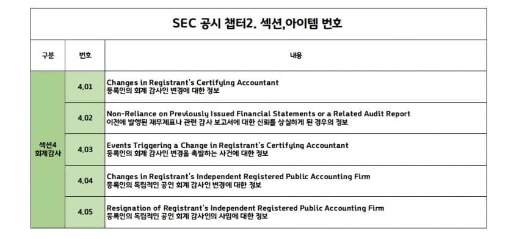

| 번호 | 항목 (영문) | 내용 |
|---|---|---|
| 4.01 | Changes in Registrant's Certifying Accountant | 등록인의 회계 감사인 변경 정보 |
| 4.02 | Non-Reliance on Previously Issued Financial Statements or a Related Audit Report | 이전 발행 재무제표·감사 보고서에 대한 신뢰 상실 정보 |
| 4.03 | Events Triggering a Change in Registrant's Certifying Accountant | 회계 감사인 변경을 촉발하는 사건 정보 |
| 4.04 | Changes in Registrant's Independent Registered Public Accounting Firm | 독립 공인 회계 감사인 변경 정보 |
| 4.05 | Resignation of Registrant's Independent Registered Public Accounting Firm | 독립 공인 회계 감사인의 사임 정보 |

### 섹션 5 — 지배구조

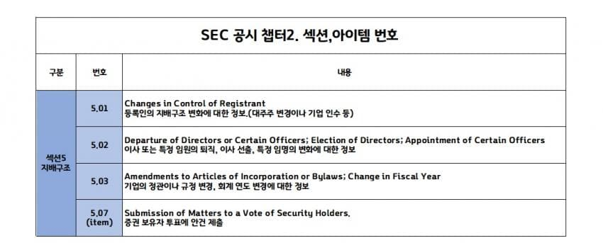

| 번호 | 항목 (영문) | 내용 |
|---|---|---|
| 5.01 | Changes in Control of Registrant | 등록인의 지배구조 변화 정보 (대주주 변경·기업 인수 등) |
| 5.02 | Departure of Directors or Certain Officers; Election of Directors; Appointment of Certain Officers | 이사·특정 임원 퇴직, 이사 선출, 특정 임명 변화 정보 |
| 5.03 | Amendments to Articles of Incorporation or Bylaws; Change in Fiscal Year | 정관·규정 변경, 회계 연도 변경 정보 |
| 5.07 (item) | Submission of Matters to a Vote of Security Holders | 증권 보유자 투표에 안건 제출 |

### 섹션 6 — 기타 정보

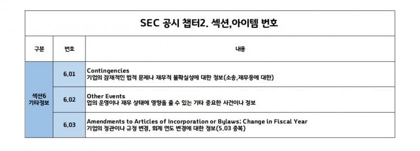

| 번호 | 항목 (영문) | 내용 |
|---|---|---|
| 6.01 | Contingencies | 잠재적 법적 문제·재무적 불확실성 정보 (소송·재무 등) |
| 6.02 | Other Events | 운영·재무 상태에 영향 줄 수 있는 기타 중요 사건·정보 |
| 6.03 | Amendments to Articles of Incorporation or Bylaws; Change in Fiscal Year | 정관·규정 변경, 회계 연도 변경 정보 (5.03과 중복) |

### 섹션 7~9 — 재무 관련 / 다른 이벤트 / 경영진·이사회

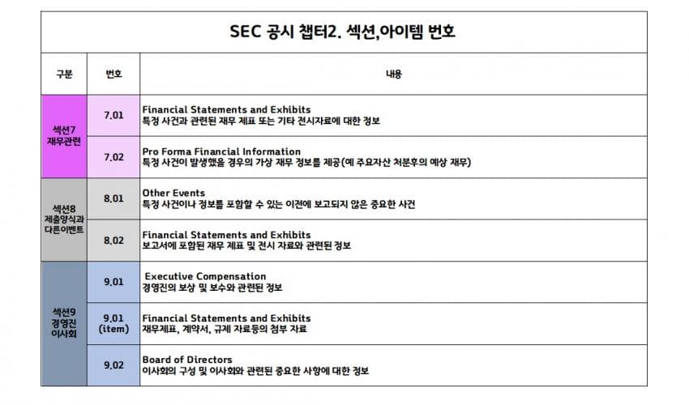

| 번호 | 항목 (영문) | 내용 |
|---|---|---|
| 7.01 | Financial Statements and Exhibits | 특정 사건 관련 재무제표·전시 자료 정보 |
| 7.02 | Pro Forma Financial Information | 특정 사건 발생 시 가상(pro forma) 재무 정보 (예: 주요 자산 처분 후 예상 재무) |
| 8.01 | Other Events | 이전에 보고되지 않은 중요한 사건 |
| 8.02 | Financial Statements and Exhibits | 보고서 포함 재무제표·전시 자료 관련 정보 |
| 9.01 | Executive Compensation | 경영진 보상·보수 정보 |
| 9.01 (item) | Financial Statements and Exhibits | 재무제표·계약서·규제 자료 등 첨부 자료 |
| 9.02 | Board of Directors | 이사회 구성 및 관련 중요 사항 정보 |

---

## 챕터 3. 활용 — 공시 흐름 역추적

당장 3개월 공시만 봐도 8-K가 난무해 뭔 내용인지 판단이 안 선다. 하지만 **제출 유형과 섹션 번호가 눈에 익으면 서류가 줄줄이 연결**된다.

### 예시 ① 오퍼링 완료 흐름 (EDGAR 타임라인)

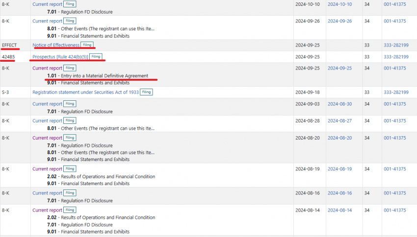

```
9/18  S-3      (증권 등록 — 오퍼링 준비)
   ↓
9/25  8-K 1.01 (Entry into a Material Definitive Agreement — 계약 체결)
   ↓
9/25  424B5    (투자설명서 — 오퍼링 조건 확정)
   ↓
9/25  EFFECT   (효력 통지 — 효력 발생)
```

자세한 내용은 따로 봐야 하지만, 이 순서만 봐도 "**오퍼링이 완료됐구나**"라는 답이 나오면서 서류가 바로바로 연결된다.

### 예시 ② 효력통지 역추적 (선반등록·추가매입옵션)

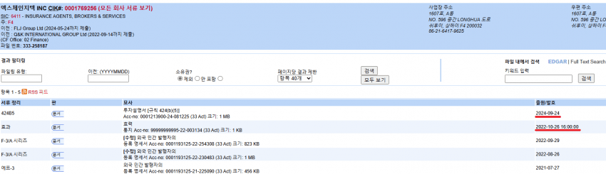

> 효력통지를 빨간 글씨로 강조한 이유:

- 예시(원작자가 "어제 급등주"라 칭한 종목)의 경우, **22년 9월에 올린 효력통지서**를 보면 **24년 9월 24일 투자설명서도 효력 발생**된다고 적혀 있음.
- 내용: "특정 주식을 매입할 수 있는 권리 부여, **25년 7월까지**".
- **선반(shelf) 등록 바꿔치기**나, 오퍼링에서 **추가매입옵션 발동** 같은 경우가 많다.
- 그래서 **오퍼링은 반드시 효력통지 확인을 통해 역추적**해봐야 한다는 게 핵심.

> 메모(원작자): 오퍼링은 여러 잡주의 오퍼링 방식을 더 많이 접하고 확신이 서야 정리 가능. (이 챕터는 추가 검증 여지가 있는 영역)

---

## stockpick 연결 메모

- 미국 EDGAR 체계라 한국 주식 정량 룰에 직접 투입 안 됨. 한국은 **DART**(전자공시)로 별도 틀 필요.
- 다만 "공시 신호로 사건을 역추적한다"는 **사고 방식**은 한국에도 이식 가능 — 유상증자·전환사채·최대주주 변경 공시 흐름 읽기 등.
- 향후 해외 사례 분석이나 ADR/해외 상장 한국 기업을 볼 때의 참고 레퍼런스.
