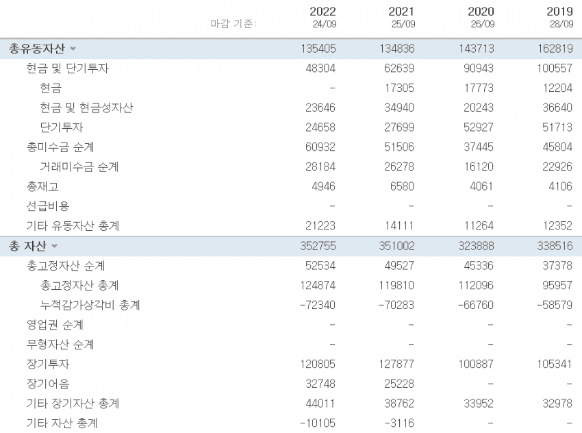
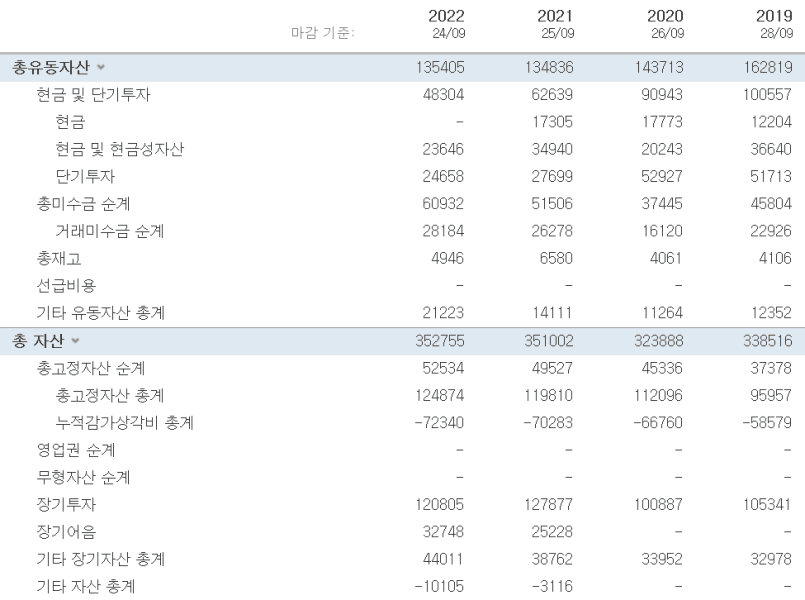
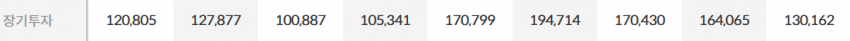
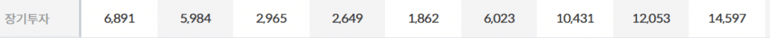
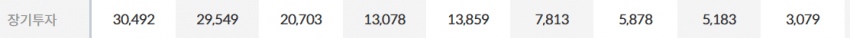
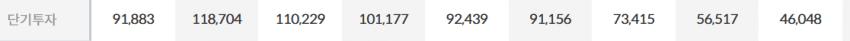
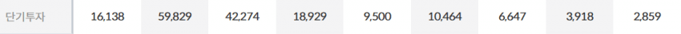
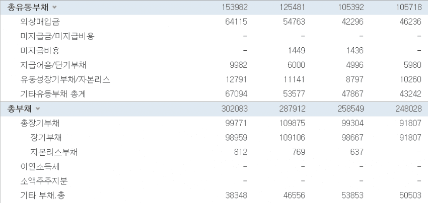
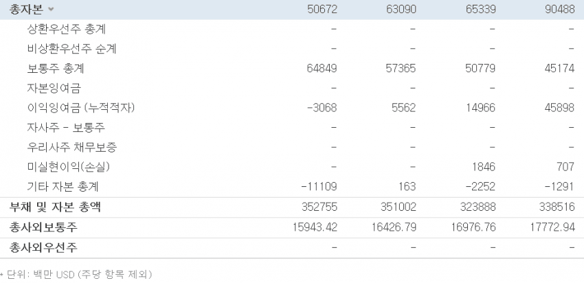

# 대차대조표(재무상태표) 배워보기

> 재무제표 시리즈 ① — 기업의 **생존 가능성**을 보는 표. 기준: 미국 시장(미장).

피터 린치: *"기업이 곤경에 처했을 때 그 기업이 살아남을 수 있을지 알아야 합니다. 대차대조표를 두려워할 필요도 없고, 확인하기 전까지는 투자 논리를 완성할 수 없습니다."*

원문 저자 강조: 생존 여부를 확인하지 않으면 그건 도박이다. 대차대조표는 초보도 이해 가능한 영역.

## 1. 정의와 기본 등식

재무제표 4종: **대차대조표(재무상태표)·손익계산서·현금흐름표·자본변동표**.

```
자산 = 부채 + 자기자본
```

- **부채**: 빚, 타인자본
- **자기자본**: 고유의 자기 돈, 사업활동에 쓰이는 돈
- **자산**: 빚 + 자기 돈 전부

총부채 + 총자본 = 총자산. 자산은 **현금화 용이성 순**으로 배열(현금이 위, 무형자산이 아래).

## 2. 자산(Assets)

### 총 유동자산 (1년 안에 현금화 가능)

**당좌자산** (판매 없이 빠르게 현금화):
- **현금 및 단기투자** — 현금 + 현금성자산. 단기투자 = 1년만기 금융상품, 양도성예금증서(CD) 등
- **미수금** — 영업거래 외 자산 매각 중 아직 못 받은 금액
- **거래미수금(외상매출금)** — 외상으로 팔고 아직 못 받은 결제금

**재고자산** (곧 현금이 되길 기다리는 것): 원자재 재고 · 재공품(미완성품) 재고 · 완제품 재고

### 고정자산
- **유형고정자산** — 기계장비·건물·토지
- **감가상각비** — 기계 노후로 인한 가치 감소분을 비용으로 반영 (→ [감가상각의 유래](03.accounting-history-railroads.md))
- **무형자산** — 상표·브랜드·특허권. 정량화 어려움
- **장기투자** — 만기 1년 후 금융상품

## 3. 부채(Liabilities)

### 총 유동부채 (1년 안에 갚을 빚)
- **외상매입금** — 원자재 받고 아직 대금 안 치른 단기 미지급금
- **지급어음** — 일정 시점·금액·장소에 지급 약속한 증권. 상품 사고 약속어음 주면 *지급어음*, 팔고 받으면 *받을어음*. 결국 부채

### 장기부채
- 자금 조달용 회사채. 만기 최소 1년 이상, 조기상환 의무 없음

## 4. 자기자본(Equity)

- **보통주** — 일반 주식. (우선주 = 배당 더 높은 대신 의결권 없음)
- **이익잉여금** — 당기순이익에서 재투자 등 하고 남은 잉여금. 배당 재원으로 사용 가능
- **자사주** — 자사주매입 규모. **많다고 무조건 좋은 건 아님** — 매입 당시 얼마나 싸게 샀는가(가치 창출 여부)가 중요

## 5. 실제 사례 — 빅테크 부채 점검 (2022/9, 단위: 백만 달러)

원문 저자가 **피터 린치 기준**을 적용:

> 탄탄한 재무구조 기준 = **(부채 − 현금성자산) < 자기자본의 25%**

| 기업 | 부채 − 현금성자산 | 자기자본의 25% | 저자 평가 |
|---|---|---|---|
| 애플 | 302,083 − 23,646 = 278,437 | 50,672 × 0.25 = 12,668 | "25%가 문제가 아닐 정도" (심각) |
| 마이크로소프트 | 198,298 − 104,757 = 93,541 | 166,542 × 0.25 = 41,635 | 초과 |
| 구글 | 109,120 − 21,879 = 87,241 | 256,144 × 0.25 = 64,036 | "그나마 안정적" |
| 아마존 | 316,632 − 53,888 = 262,744 | 146,043 × 0.25 = 36,510 | "부채 문제 상당" |

- 애플 부채비율 = 302,083 / 352,755 × 100 = **85.6%**
- 저자 종합: *"산업 종류에 따라 다르게, 장기적으로 봐야 한다는 정도는 알지만 이게 맞는 건지 잘 모르겠다"* (판단의 어려움 시인)

## 6. 핵심 지표 정리

1. **부채비율** = 부채 / 자산 (또는 부채총계/자본총계 — [연차보고서](05.annual-report.md) 편 참고)
2. **순부채** = 부채 − 현금성자산 (핵심)
3. **자본 대비 순부채** = 순부채를 자기자본의 25% 기준과 비교

## 원문 캡처 이미지

> dcinside 원문에서 가져온 이미지 **10장** (작성 순서). 캡션은 원문 저자의 인접 설명을 옮긴 것.


**[01]**


**[02]**


*…차대조표(재무상태표), 손익계산서, 현금흐름표, 자본변동표로 나뉜다. 그 중 대차대조표를 보면 기업의 부채와 자본, 자산의 현황을 알 수 있다.*

**[03]**


*…칸의 총 부채와 총 자본을 더하면 총 자산값이 나오는 걸 볼 수 있다. ①자산 ②부채 ③자기자본 순서로 나누어서 살펴보자. (단위는 백만 달러)*

**[04]**


*…비용이다. ■ 무형자산 - 상표, 브랜드네임, 특허권 등이 있다. 정량화된 가치로 환산하기 어렵다. ■ 장기투자 - 만기가 1년 후인 금융상품*

**[05]**



**[06]**



**[07]**



**[08]**



**[09]**


*…면 현금화가 쉬운 종목일수록 위에 위치한다. 그래서 당연히 현금이 젤 위에 있다. 무형자산은 정확한 가치환산부터 어렵기 때문에 아래에 위치한다.*

**[10]**


*…디로 부채다. -총 부채 ■ 장기부채 - 기업 자금 조달을 위한 채권으로 회사채가 이에 해당, 만기가 최소 1년 이상이고 조기상환 의무가 없다.*

---

> 출처: https://gall.dcinside.com/mgallery/board/view?id=stockus&no=5553453 (작성자 _케이네)

> ⚠️ **stockpick 메모**: 위 수치·기준·해석은 **원문 저자(미국주식 갤러리)의 교육용 설명**이다. 피터 린치 25% 기준은 휴리스틱이며 산업별로 다르게 적용된다. 한국 회계는 항목명(재무상태표 표준계정)이 다르다. 정량 룰에 넣으려면 별도 검증 필수.
