# 손익계산서 배워보기

> 재무제표 시리즈 ② — 일정 기간 기업의 **성적표**(매출·영업이익·순이익). 기준: 미장.

워렌 버핏: *"회계는 비즈니스 경영의 언어와도 같습니다."*

## 1. 기본 구조 (이익의 흐름)

```
매출액
 − 매출원가
 ───────────
 매출총이익
 − 영업비용(판관비·감가상각·이자 등)
 ───────────
 영업이익
 − 법인세
 ───────────
 당기순이익
```

## 2. 항목 정의

### ① 매출 단계
- **총 매출(Revenue)** = 가격 × 판매량. 상품·서비스로 벌어들인 돈(예금·투자 수익 포함)
- **매출원가(Cost of Revenue)** — 상품/서비스 제공에 직접 투입된 원가
- **매출총이익(Gross Profit)** = 매출 − 원가
  - 예: 아이폰 매출 1억 − 원가 6천만 = 매출총이익 4천만
  - 애플 실측: 394,328 − 223,546 = **170,782** (백만 달러)

### ② 영업이익 단계
- **판관비(SG&A)** — 광고선전비·인건비·임차료·보험료 등
- **감가상각비** — 유형자산 노후로 인한 가치 감소분
- **이자수익/비용** — 영업이자비용은 음수로 표시되기도
- **영업이익(Operating Income)** = 매출 − 영업비용(원가 포함)
  - 애플 실측: 394,328 − 274,891 = **119,437**
  - 💡 저자 강조: *"영업이익은 기업의 실제 이익에 가까우며 매출보다 더 중요. 뉴스에서 매출·영업이익이 같이 나오면 영업이익을 유심히 보라."*

### ③ 순이익 단계
- **세전당기순이익(EBT)** — 법인세 차감 전. 영업이익과 거의 동일
- **당기순이익(Net Income)** = 세전순이익 − (세전순이익 × 법인세율)
  - 예: 3천만 × 20% = 600만 세금 → 2,400만 당기순이익

### ④ 주당순이익(EPS)
- **기본 EPS** = 당기순이익 ÷ 발행주식수
- **희석 EPS** — 전환사채·전환우선주 등 잠재 보통주를 전환했다고 가정한 "가장 보수적" 수치
- 💡 저자: *"기본 EPS와 희석 EPS의 괴리가 큰 기업이라면 반드시 확인하라."*

## 3. 마진(수익성)

| 마진 | 계산 |
|---|---|
| 매출총이익률(Gross Margin) | 매출총이익 ÷ 매출 |
| 영업이익률(Operating Margin) | 영업이익 ÷ 매출 |
| 순이익률(Net Profit Margin) | 당기순이익 ÷ 매출 |

## 4. 실제 사례 (저자 해석)

- **애플** — 9년 영업이익 안정 성장, 코로나 이후 거의 2배
- **구글** — 매출 대부분 광고 → 시장 상황 따라 변동 큼. "코로나 최고 수혜자"
- **아마존** — 매출은 최대(약 50만)인데 영업이익은 애플의 1/10 수준. *"많이 벌지만 빠져나가는 비용도 많다"*
- **교촌치킨(한국)** — 매출 약 5천억인데 영업이익 28억. 비용 비중이 커져 21년 400억 → 22년 88억 급락. (매출 vs 영업이익 괴리 예시)

## 5. 투자 판단 팁 — ROE

```
ROE(자기자본이익률) = 당기순이익 ÷ 자기자본 × 100%
```
- 대차대조표의 자기자본 + 손익계산서의 당기순이익만 있으면 직접 계산 가능
- 평가 기준(저자): *"섹터마다 다르지만 평균적으로 ROE 10 정도면 나쁘지 않다."*

**빅테크 ROE 해석**: 애플 ≈160(자본이 적어 높은 영향 有)·마소(안정적 고ROE)·구글(통과)·아마존(변동 심하고 작년 마이너스, PER도 −600~+600으로 기이). 삼성전자 5년 평균 13.85.

**극단 사례 — 신용평가기관**: S&P ROE ≈1000, 무디스 200+ (마이너스 자본이라 N/A도). 모니시 파브라이 인용: *"무디스는 10만 달러 애널리스트 한 명당 400만 달러 수수료를 번다."* → **산업 자체가 돈벌이**인 구조적 해자. 반대로 자동차·항공은 자본 많이 들고 경쟁 극심해 이익 내기 힘든 섹터.

## 6. 당기순이익 계산 프로세스 (정리)

```
매출
 − 비용 (① 매출원가 ② 감가상각비 ③ 판관비 ④ 이자)
 ─────────────
 세전당기순이익
 − 법인세 (세전순이익 × 법인세율)
 ─────────────
 (세후)당기순이익  ← 손익계산서 최종 결과물
```

저자 최종 메시지: *"재무제표가 투자의 기본이라는 사실은 변함없다. 기업 분석이 싫다면 단순히 SPY를 사고 몇 년 신경 안 쓰는 것도 현명한 선택."*

## 원문 캡처 이미지

> dcinside 원문에서 가져온 이미지 **18장** (작성 순서). 캡션은 원문 저자의 인접 설명을 옮긴 것.


**[01]**


**[02]**

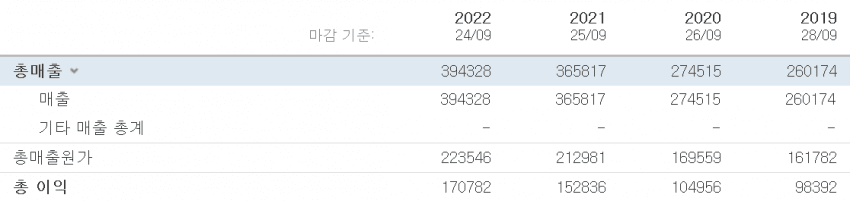
*…ent)를 보면 일정 기간동안 기업의 매출 과 영업이익 , 그리고 순이익 현황을 알 수 있다. (미주갤인만큼 영어도 추가해달라는 피드백을 수용)*

**[03]**

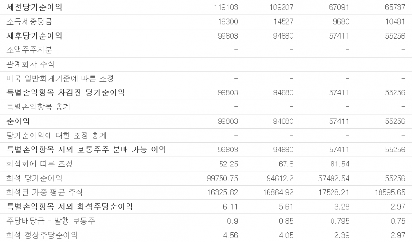

**[04]**

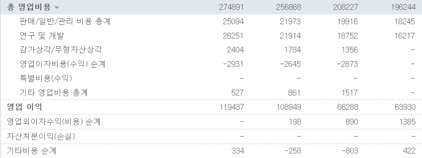
*…4천만원의 매출 총이익이 남는다. 위 표에서 394328(총 매출) - 223546(총 원가) = 170782(총 이익) 을 확인할 수 있다.*

**[05]**

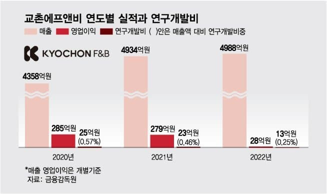
*…뉴스에서 기업의 매출과 영업이익이 같이 나올텐데 영업이익을 유심히 보길 바란다. 미국 기업은 아니지만 친숙한 한국 기업으로 좋은 예시가 있다.*

**[06]**

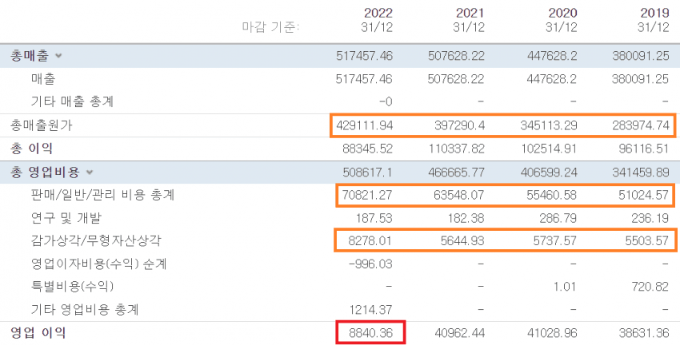
*…뉴스로 교촌치킨 소식을 본 사람도 있을 것이다. 작년에 매출 약 5천억원에 비해 초라하게 작은 28억원의 영업이익이 보인다. (자회사 포함 X)*

**[07]**


*…간 애플, 마소, 구글, 아마존의 연간 영업이익을 살펴 보자. 왼쪽으로 갈수록 최근이고 세로선 왼쪽부터 2020년 코로나 팬데믹 시작 부분이다.*

**[08]**


**[09]**


**[10]**


*…광고인데 광고 수익은 시장 상황에 따라 상당히 변동이 큰 특징이 있다. 다른 빅테크도 코로나의 수혜자지만 최고의 수혜자는 구글이 아닐까 싶다.*

**[11]**

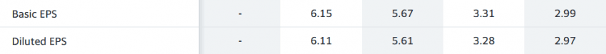
*…환한걸로 가정하여 '보수적으로' 희석해서 주당순이익을 구한게 희석 주당순이익이다. 가장 안전하고 겸손한 정보로 주주를 보호하기 위함이 목적이다.*

**[12]**

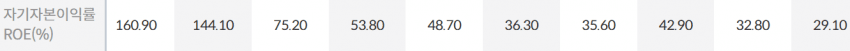
*…균적으로 ROE가 10정도만 돼도 나쁘지 않다. 애플, 마소, 구글, 아마존 네 빅테크를 비교해보자. 제일 왼쪽이 최근이며 모두 연간 ROE다.*

**[13]**

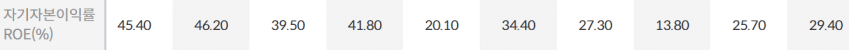

**[14]**

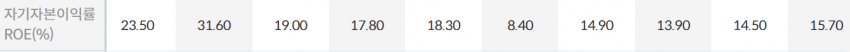

**[15]**

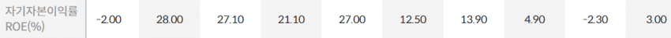

**[16]**


**[17]**

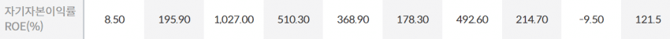
*…이는 정말 끝내주는 수익성을 자랑하는 비즈니스입니다. 심지어 금융위기 때 모든 신용평가를 엉망으로 해놓아도 무디스는 전혀 타격없이 멀쩡합니다.*

**[18]**

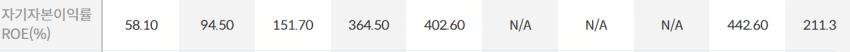
*…어디가서 ROE 1000이라는 숫자를 볼 수 있을까.*

---

> 출처: https://gall.dcinside.com/mgallery/board/view?id=stockus&no=5707817 (작성자 _케이네)

> ⚠️ **stockpick 메모**: 수치·해석은 원문 저자의 교육용 설명(미장 기준). ROE 10/PER 등 기준은 휴리스틱이며 섹터 의존적. 한국 손익계산서 표준계정과 항목명이 다름.
