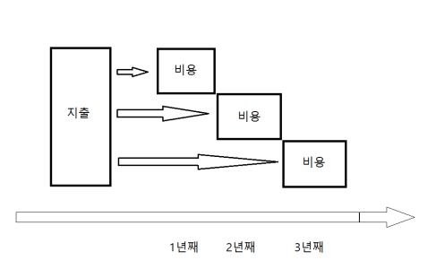
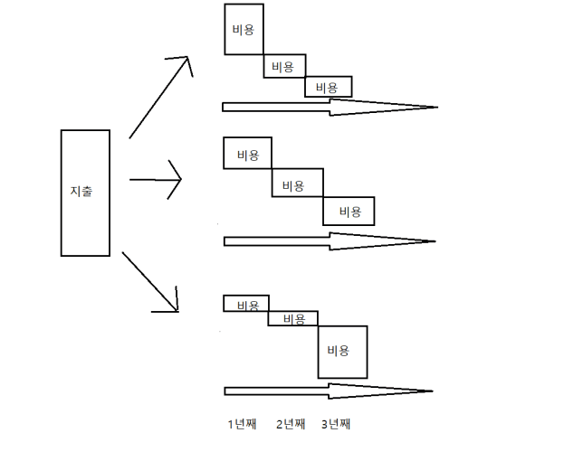
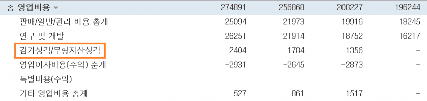

# 19세기 철도회사가 만든 회계 혁신 — 감가상각의 유래

> 📚 **이 문서 한눈에**
> - **배우는 것**: ① 감가상각이 왜·어떻게 생겨났는지 ② 현금주의 → 발생주의로의 패러다임 전환 ③ '이익'이 가공될 수 있다는 발생주의의 그림자
> - **난이도**: 🟢입문 (역사·개념 위주, 숫자 계산 없음)
> - **왜 중요(stockpick)**: 손익계산서의 '이익'은 사람이 만든 가공물이라, 그 신뢰도를 의심하고 현금흐름으로 교차 검증하는 습관의 출발점이다.

> 재무제표 시리즈 보충편 — **감가상각**과 **발생주의 회계**가 어디서 왔는가. 손익계산서·현금흐름표를 이해하는 역사적 배경.

> 🍞 **들어가기 전 한 줄**: 이 글은 "왜 한 번에 큰돈을 쓴 해에도 이익을 고르게 보여줄 수 있을까?"라는 질문에서 시작한다. 그 답이 바로 **감가상각**이다.

## 1. 철도회사가 직면한 문제

산업혁명·증기기관차 시대, 리버풀–맨체스터 철도 투자자들이 *"매년 두둑한 배당"*을 받자 너도나도 철도에 투자.

하지만 경영자에겐 골치 아픈 문제가 있었다 — **고정자산**(쉽게: 토지·건물·기계처럼 오래 쓰는 비싼 재산) **투자의 극단적 편중**:
- 토지 구입, 산 깎기, 터널 굴착, 철로·역사 건설, 기관차·객차 제조
- *"투자할 때마다 막대한 지출이 한 번에 발생"* → 그 시기는 적자, 투자 없는 시기는 흑자
- 결과: **언제 주주가 됐느냐만으로 배당금이 달라지는 불공평**

> 🍞 비유 (일상): 친구 5명이 함께 10년 쓸 캠핑카(1,000만 원)를 산다고 하자. 산 첫 달에 들어온 사람만 "이번 달 우리 적자 1,000만 원"을 뒤집어쓰고, 그다음 달에 들어온 사람은 "우리 흑자!"라며 회비를 덜 낸다면 불공평하다. 큰 지출이 **한 시점에만** 잡히기 때문에 생기는 문제다.

## 2. 혁신 — 지출의 평준화 = 감가상각

현명한 경영자의 깨달음:

> *"지출했을 당시 한 번에 계산하지 말고, **몇 기(期)로 비등하게 나누어** 계산하면 된다."*

- 한 번에 쏠린 지출을 일정 기간에 걸쳐 **평준화**(쉽게: 1,000만 원을 한 해에 다 잡지 않고 10년이면 매년 100만 원씩 나눠 잡기)해 '비용'으로 처리 → 매년 이익을 고르게
- 덕분에 막대한 고정자산 투자에도 **주주에게 매년 곧바로 배당** 지급 가능

이것이 **감가상각(Depreciation)**(쉽게: 오래 쓰는 자산의 값을 사용 기간에 걸쳐 조금씩 나눠 비용으로 인식하는 방법).

> 🔧 비유 (개발자): 한 번 결제로 끝나는 라이선스 비용을 회계에선 산 달에 전부 비용 처리하지 않는다. 서버 장비를 5년 감가상각하는 것은, 마치 큰 인프라 구축 비용을 **5년치 운영비로 분할 상각해 매 분기 손익에 고르게 반영**하는 것과 같다. 캐시처럼 "한 번 계산해 여러 기간에 나눠 쓰는" 구조다.

## 3. 패러다임 전환 — 현금주의 → 발생주의

감가상각 등장으로 회계 개념 자체가 바뀜 — **현금주의**(쉽게: 돈이 실제로 들어오고 나간 시점에만 기록)에서 **발생주의**(쉽게: 돈의 이동과 무관하게 '경제적 사건이 일어난 시점'에 기록)로:

| | 현금주의 회계 | 발생주의 회계 |
|---|---|---|
| 등식 | 수입 − 지출 = 순수입 | 수익 − 비용 = 이익 |
| 인식 | "금고에 돈이 쌓였다" | 종이(손익계산서) 위 '이익'을 기입 |
| 대상 | 사업가 본인을 위한 장부 | **주주를 위한 결산서** |

- **지출(Expenditure)** = 실제 현금 유출 (팩트) (쉽게: 통장에서 진짜 빠져나간 돈)
- **비용(Expense)** = 더 인위적인 개념 (가공) (쉽게: "이번 기에 얼마만큼을 비용으로 칠지" 사람이 규칙으로 배분한 숫자)
- *"기업은 주주들의 이익을 위해 존재한다"* 는 원칙 확립 → 현대 손익계산서는 주주를 위해 쓰인다

> 🍞 비유 (일상): '지출'은 영수증에 찍힌 실제 결제 금액이고, '비용'은 "이 캠핑카는 10년 쓸 거니까 올해 몫은 100만 원"처럼 **사람이 규칙을 정해 나눠 적은 숫자**다. 영수증은 못 바꾸지만, 나누는 규칙은 바꿀 수 있다 — 이 점이 4번 항목의 핵심으로 이어진다.

## 4. 어두운 면 — 발생주의와 분식

저자는 혁신의 그림자도 지적:

- **비용은 애초에 인위적 개념** → 맘만 먹으면 배분을 자신에게 유리하게 **조작** 가능
- *"수입·지출이 팩트(사실)라면 수익·비용은 픽션(가공)"* — 이 픽션을 조작해 '이익'을 원하는 대로 만든다
- 결과: **흑자도산**(쉽게: 장부상으론 이익이 나는데 정작 쓸 현금이 없어 망하는 것) — *"분명 이익이 있는데 돈이 없다"*. 손익계산서는 흑자인데 [현금흐름표](04.cash-flow-statement.md)는 적자

> 🔧 비유 (개발자): '이익'은 캐시된 계산 결과 같은 값이라, 캐시를 채우는 로직(=비용 배분 규칙)을 손대면 표시되는 숫자가 달라진다. 현금흐름은 그 캐시를 신뢰하지 않고 **원본 소스(실제 돈의 입출금)를 다시 조회**해 검증하는 것과 같다.
- 저자 결론: *"발생주의 회계는 악의적 배분과 함께 진화해 왔다. **애초부터 '이익'은 실제와 불일치시키기 위해 존재**하기 때문이다."*

> 📌 이 분식 가능성이 바로 **현금흐름표가 필요한 이유**로 직결된다. (다음 편)

## ✅ 핵심 정리

- **감가상각의 탄생 배경**: 19세기 철도회사의 거대한 일회성 고정자산 투자 → 투자한 해만 적자가 되어 주주 배당이 불공평해지는 문제를 풀기 위해 등장했다.
- **핵심 아이디어 = 평준화**: 큰 지출을 여러 기간에 고르게 나눠 '비용'으로 처리하면, 매년 이익이 고르게 나와 배당을 꾸준히 줄 수 있다.
- **패러다임 전환**: 돈의 입출금 시점만 보던 현금주의에서, 경제적 사건 시점에 기록하는 발생주의로 바뀌었고, 회계의 목적도 '사업가 본인 장부' → '주주를 위한 결산서'로 이동했다.
- **'이익'은 가공물**: 지출은 팩트지만 비용(따라서 이익)은 사람이 규칙으로 만든 픽션이라, 유리하게 조작될 수 있다.
- **흑자도산의 씨앗**: 손익계산서는 흑자인데 현금은 바닥나는 일이 생기며, 이것이 현금흐름표로 교차 검증해야 하는 이유다.

## 🧠 셀프 체크

1. 철도회사가 감가상각을 발명하기 전에는, 같은 회사 주주인데도 **배당이 달라지는 불공평**이 왜 생겼을까? (힌트: 큰 지출이 한 시점에만 잡힌다)
2. '지출(Expenditure)'과 '비용(Expense)' 중 사람이 규칙으로 조작할 여지가 있는 쪽은 어느 것이고, 그 이유는 무엇인가?
3. 손익계산서상 '이익'이 흑자여도 회사가 망할 수 있다는데(흑자도산), 그 가능성을 잡아내려면 어떤 재무제표를 함께 봐야 할까?

## 원문 캡처 이미지

> dcinside 원문에서 가져온 이미지 **4장** (작성 순서). 캡션은 원문 저자의 인접 설명을 옮긴 것.

**[01]**

**[02]**

*…이다. 한번에 쏠린 지출을 일정 기간에 거쳐 '평준화'하자는 이야기다. 이것이 바로 참신한 회계처리 감가상각 이다! 감가상각의 구조*

**[03]**

*…악의적인 배분 구조*

**[04]**

*…평준화 시키는 법을 철도 회사 경영진이 발명했다. 이것이 '감가상각'으로써, '이익'을 다루는 현대 회계의 분기점이다. 고정자산은 감가상각한다!*

---

> 출처: https://gall.dcinside.com/mgallery/board/view?id=stockus&no=5744715 (작성자 _케이네)
> 원문 인용 도서: 『부의 지도를 바꾼 회계의 세계사』 — 다나카 야스히로 (위즈덤하우스)

> ⚠️ **stockpick 메모**: 역사·개념 설명 위주라 검증 부담 낮음. 핵심 시사점 = **손익계산서 '이익'은 가공될 수 있다 → 현금흐름·발생액(accruals)을 교차 확인**. 정량 룰에서 이익 기반 지표의 신뢰도를 따질 때 배경 지식으로 유용.
