# 현금흐름표 배워보기

> 재무제표 시리즈 ③ — *"재무제표의 꽃."* 손익계산서의 '픽션'을 보완하는 **'팩트'**. 기준: 미장.

도입 화두: *"'흑자도산'을 들어본 적 있는가?"* 손익계산서상 흑자인데 돈이 없어 도산하는 현상 → 이를 잡아내는 게 현금흐름표.

## 1. 픽션 vs 팩트

- **손익계산서 = 픽션(가공)**, **현금흐름표 = 팩트(사실, 실제 현금 유출입)**
- 삼성전자 2020: 당기순이익 26만 억(픽션) → 영업활동현금흐름 65만 억(팩트). 실제 번 돈이 장부 이익보다 훨씬 큼

## 2. 4대 구성 + 건전성 패턴 '+마마+'

| 항목 | 훌륭한 기업 | 부실 기업 |
|---|:---:|:---:|
| 영업활동 현금흐름 | **+** | − |
| 투자활동 현금흐름 | **−** | + |
| 재무활동 현금흐름 | **−** | + |
| 잉여현금흐름(FCF) | **+** | − |

저자 표현: *"쁠마마쁠(+,−,−,+)을 기억하자."* (쁠=현금 들어옴, 마=현금 나감)

- **영업활동** — 판매로 현금 증가(+)
- **투자활동** — 활발한 투자로 현금 사용(−)
- **재무활동** — 배당·부채상환으로 현금 차감(−)

## 3. 영업활동 현금흐름 (가장 중요)

손익계산서 **당기순이익에서 출발** → 픽션을 팩트로 조정:
- **당기순이익** — 출발점. 예: 장부상 −500인데 실제 현금유출 없었으면 +500 더해 0으로 보정
- **감가상각** — 고정자산을 여러 기에 나눈 '픽션(비용)' → 현금 안 나갔으니 더해줌
- **이연법인세** — 장부가액 차이로 미래에 낼/경감할 세금. '미래' 세금이라 현금 변동 없음 → 보정
- **비현금항목** — 부채로 자산 취득, 주식 발행 인수 등 현금흐름 없는 항목 상쇄
- **운전자본 증감** — 매출채권·재고(유동자산), 매입채무·선수금(유동부채) 등 운영자금 증감

애플 예: 당기순이익 99,803(픽션) → 영업활동현금흐름 122,151(팩트). 3년 만에 거의 2배.

## 4. 투자활동 현금흐름 — CapEx

**자본적지출(CapEx)** vs 수익적지출:
- **자본적지출** — 냉난방 설치, 엔진 교체, 건물 증축 → 자산 **가치 상승**
- **수익적지출** — 도색, 유리 교체, 타이어 교체 → 자산 **원상복구**

저자: *"연속 적자 속 과한 CapEx는 독이지만, 수익력 있는 기업의 충분한 CapEx는 성장의 발판."*

## 5. 재무활동 현금흐름

- **현금배당 지급** — 주주환원이나 *"과한 배당은 세금·자본배분 악영향"*. 애플 약 −14,000선 일정 유지
- **자사주 매입/처분** — 취득(−)/처분(+). 애플은 꾸준히 매입 증가
- **부채 발행/상환** — 상환(−)/발행(+)

## 6. 잉여현금흐름(FCF) — 결론 지표

> *"누군가 '이 기업이 결국 실제 돈을 얼마 버나?'라고 물으면, '잉여현금흐름을 보면 돼'라고 답하라."*

- 모든 비용 지불 후 실제 창출 현금. 인수·자사주매입·배당의 재원
- **주주가 반드시 확인해야 할 지표**

## 7. 사례 — 건전 vs 부실

**빅테크(저자 총평)**: 애플 "현금의 제왕" · 마소 "근본기업, 코로나 후 잉여현금 두둑" · 구글 "코로나 최고 수혜자" · 아마존(영업활동 좋으나 재무활동 의문, FCF는 합격)

**부실 패턴 '마마쁠마'** (= 수익 없고(−), 무리한 투자(−), 부채로 현금 뻥튀기(+), FCF 바닥(−)):
- **베드배스비욘드(BBBYQ)** — 공급망 붕괴로 4월 파산 신청, 상장폐지 직전
- **에코프로(한국)** — 영업(−)·투자(−)·재무(+, 부채발행+배당인상)·FCF(−). 저자: *"완벽한 마마쁠마"*
  - 회계사 인용: *"부도 기업은 영업·투자가 동시에 (−), 재무(차입)에서만 (+). 정상 영업 유동성 없이 외부차입으로 버티는 기업"*

저자 결론: *"손익계산서가 흑자여도 현금흐름표는 돈이 빠져나간 '사실'을 못 속인다. 최종 투자 결정은 무조건 본인 주도. 남이 아닌 본인을 위한 공부를 하라."*

## 원문 캡처 이미지

> dcinside 원문에서 가져온 이미지 **28장** (작성 순서). 캡션은 원문 저자의 인접 설명을 옮긴 것.

**[01]**

**[02]**

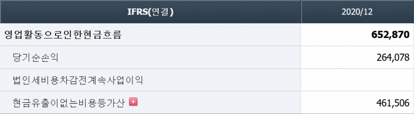
*…생이니 손익계산서를 무시하라는 말이 아니다. 무슨말을 하는지 삼성전자의 20년도 현금흐름표 사례를 통해 간단하게 이야기하겠다. (단위 : 억원)*

**[03]**

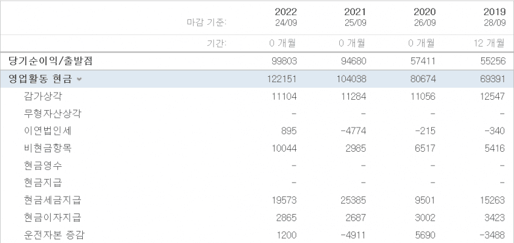
*…(+, - , -)를 기억하자 물론 마지막의 잉여현금흐름도 (+) 가 좋다. 현금이 늘어나야 좋은건 당연하다. 날짜는 표 맨 위에 있으니 참고*

**[04]**

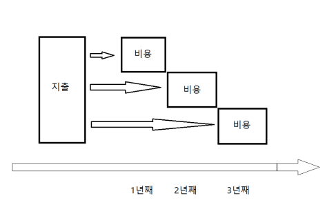
*…걸 볼 수 있다. ■ 감가상각 (Depreciation) - 기계 설비와 같은 고정자산을 일정 기간동안 균일하게 '픽션(비용)'으로 처리 한 것*

**[05]**

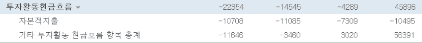
*…(Working Capital)은 대차대조표 상의 유동자산에서 유동부채를 뺀 값으로 기업의 유동성과 단기지급능력을 알 수 있는 좋은 지표다.)*

**[06]**

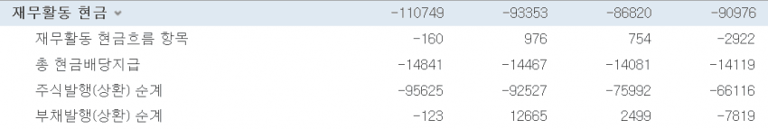
*…다. 토지 취득도 포함이다. 연속된 적자 속에 과한 카펙스는 독이겠지만, 수익력있는 기업이라면 충분한 카펙스가 성장을 위한 중요한 발판이 된다.*

**[07]**

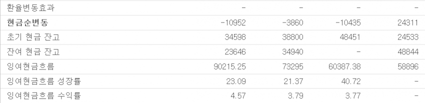
*…-)다. 반대로 부채를 '발행'한다면 현금을 얻으니 (+)다. 19년과 22년에 부채를 갚고, 20년과 21년에 부채를 발행하는 모습을 보인다.*

**[08]**

*…비교로 각인시켜주겠다. 먼저 ① 영업활동(+) 만 모아서 보자. 생산이나 판매로 돈을 많이 번 만큼 (+)다. 기업의 주된 활동이니 제일 중요*

**[09]**

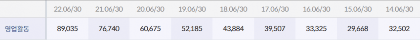
*…업활동 현금흐름이 증가(+)한다. 합격! 이런식으로 보면 된다. 기본적인 현금흐름 추세를 파악하는 것만큼은 눈만 달려있으면 누구나 할 수 있다.*

**[10]**

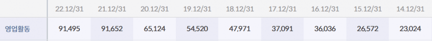

**[11]**

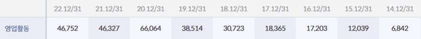
*…구글이다. 22년에 성장이 주춤하기는 했지만 코로나 이후로의 성장이 돋보인다. 그리고 마소조차 근소한 차이로 구글 영업활동에 미치지 못한다.*

**[12]**

*…다음으로 ② 투자활동(-) 을 보자. 투자를 위해 현금을 사용했으니 (-)다. '투자'와 '성장', 그리고 '미래'를 모두 같은 키워드로 보도록*

**[13]**

**[14]**

**[15]**

**[16]**

*…을 얼마나 하는지 알 수 있다. 주주환원을 열심히 할 수록 주주 친화적인 기업이라는 뜻이고 (-)를 가리킨다. 그만큼 현금을 사용했으니 말이다.*

**[17]**

*…투자의 매력이 이런 주주친화적인 면모에서 드러나는 것이다.*

**[18]**

**[19]**

**[20]**

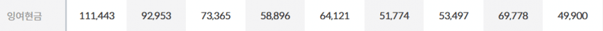
*…분의 자금이 팍팍 쌓여야 투자를 하든, 자사주 매입을 하든, 배당을 주든 주주에게 이롭다. 주주 입장에서 상당히 중요한 지표가 잉여현금흐름이다.*

**[21]**

**[22]**

**[23]**

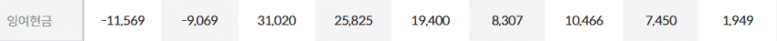

**[24]**

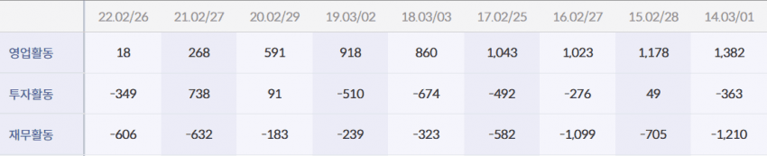
*…그러나 코로나 이후 온라인 상거래에 뒤쳐저 수요를 따라잡지 못해 공급망 붕괴가 일어난 것이다. 결국 한달 전인 4월에 파산 신청을 하고 말았다.*

**[25]**

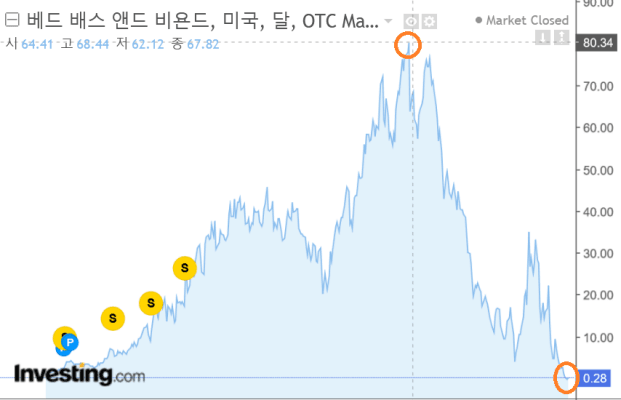
*…에 알 수 있다. 투자활동이나 재무활동은 그렇다쳐도 기업의 근본은 뛰어난 영업활동에서 나온다. 영업이 안돼서 돈을 못 벌면 기업은 망하게 된다.*

**[26]**

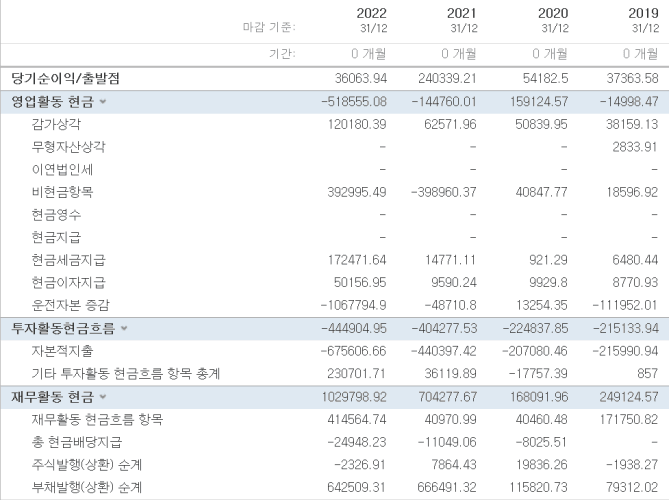
*…로 가격이 상승한 '밈 주식'의 말로다. '밈 주식'하면 떠오르는 국내 기업이 있다. 바로 '에코프로' 다. 거두절미하고 현금흐름표를 봐 보자.*

**[27]**

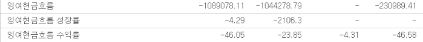

**[28]**

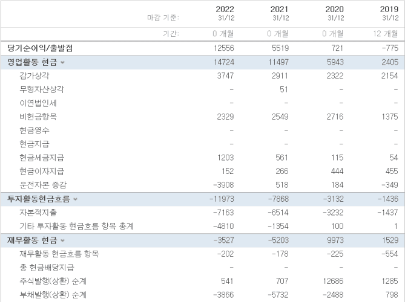
*…프로 현금흐름의 이러한 추세가 지속된다면 투자를 재고해보길 바란다. 변동성있는 주식을 원한다면 차라리 테슬라 같은 걸 사는게 나을 지도 모른다.*

---

> 출처: https://gall.dcinside.com/mgallery/board/view/?id=stockus&no=5799067 (작성자 _케이네)

> ⚠️ **stockpick 메모**: '+마마+' 패턴은 강력한 직관적 스크리너지만 **성장기/쇠퇴기·업종에 따라 예외 많음**(고성장주는 재무활동 +가 정상일 수 있음). FCF·발생액 기반 지표는 정량 룰 후보로 가치 있으나, 한국 기업 현금흐름표 계정 매핑 후 백테스트 검증 필요. 개별 종목 언급(에코프로 등)은 원문 시점의 저자 의견.
